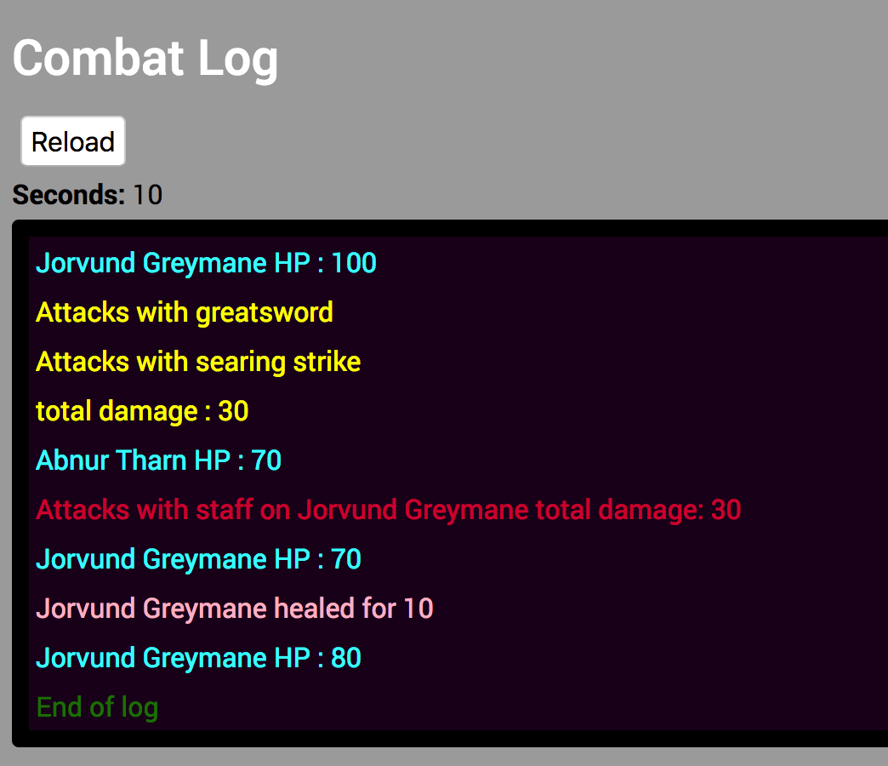

## Combat text for an action RPG
Displays combat text over time using player stats manipulated from game events

## Features
- Messages are highlighted in different colours reacting to game events taking place. 
- Game objects can only perform actions while alive and display feedback about the game state.
- Messages can be displayed all at once or using the timer in seconds



### Installation 
Install [Node.js](https://nodejs.org) and [npm](https://www.npmjs.com/).

Next git clone the repo to a local folder and run these console commands into a terminal:
```bash
cd combatlog
npm install
npm start
```
To create a new build for deployment run the console command then follow the steps to run the server on a port of your choice:
```bash
yarn build
```
### Changelog
- Fixed leechLife() to fire only once per round 
- Events and actions split into modules
- Fixed a bug with player doing too much attack damage in a combat round 
- Moved player & enemy objects to modules
- Added health checks to enemies
- Split players stats into distinct objects
- added dmg calculation and heal effects
- added actions queue
- hit and miss damage text
- damage text highlighting
- tick() and doCombatLog() changes 
- Fixed up combat text functions
- Initial commit